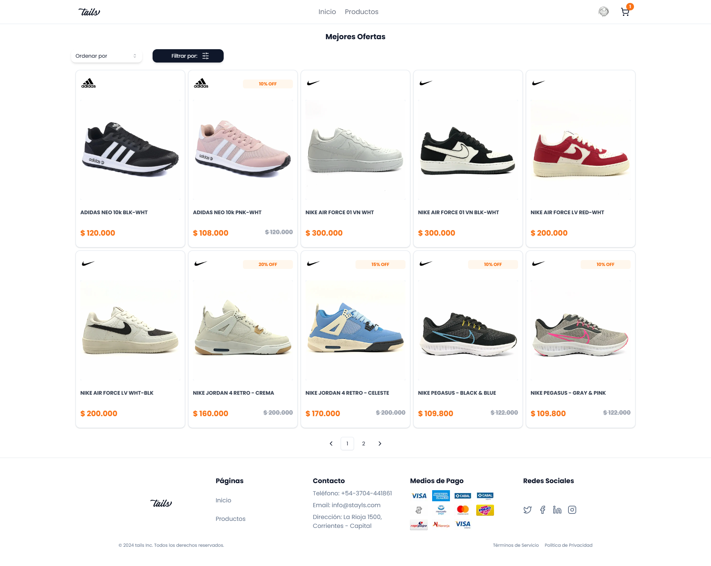

# E-commerce de Zapatillas

Este proyecto es un sistema de e-commerce enfocado en la venta de zapatillas. El sistema está dividido en dos partes principales: el servidor y el cliente.

## Descripción del Proyecto
### Screenshot





### Servidor (Back end)
El servidor está construido utilizando **Node.js** y **Express**. Toda la lógica del servidor, incluyendo la gestión de usuarios, productos, órdenes y autenticación, se maneja en esta parte del proyecto. Los datos se almacenan en una base de datos **MongoDB**.

### Cliente (Front end)
El cliente está desarrollado utilizando **Next.js** (versión 14 o superior). La aplicación del lado del cliente se encarga de la interacción con los usuarios, mostrando productos, manejando el carrito de compras, y procesando el checkout.


## Tecnologías Utilizadas

### Back end:
- Node.js
- Express
- MongoDB
- JWT (para autenticación)
- Mongoose (para modelar los datos de MongoDB)

### Front end:
- Next.js (14+)
- React
- Tailwind CSS 
- ShadCn

## Instalación

### Prerrequisitos
- Node.js (v18.x o superior)
- MongoDB (local o MongoDB Atlas)

### Configuración del Back end

1. Clona este repositorio:

    ```bash
    git clone https://github.com/JamesBarr456/Styles---Ecommerce.git
    ```

2. Navega al directorio del servidor:

    ```bash
    cd servidor
    ```

3. Instala las dependencias:

    ```bash
    npm install
    ```

4. Configura las variables de entorno creando un archivo `.env` en la raíz del proyecto del servidor. Asegúrate de incluir variables como `PORT`, `MONGODB_URL`, y `TOKEN_JWT_SECRET`. 

 ***Nota***: Asegúrate de que los puertos del cliente y el servidor no sean igual o tendras problemas con alguno de ellos al levantarlos

5. **Inicia MongoDB** ejecutando el siguiente comando en una terminal separada:

    ```bash
    mongod
    ```

6. **Carga los datos iniciales** (semillas) en la base de datos:

    ```bash
    npm run seed
    ```

7. **Inicia el servidor**:

    ```bash
    npm run dev
    ```

### Configuración del Front end

1. Navega al directorio del cliente:

    ```bash
    cd cliente
    ```

2. Instala las dependencias:

    ```bash
    npm install
    ```

3. Inicia la aplicación cliente:

    ```bash
    npm run dev
    ```
4. Para acceder a la aplicación con una cuenta de administrador o usuario, puedes utilizar las siguientes cuentas de prueba:

   - **Cuenta de Administrador**: 
     - **Correo**: `test1@gmail.com`
     - **Código**: `39320266`

   - **Cuenta de Usuario**: 
     - **Correo**: `test2@gmail.com`
     - **Código**: `40822345`

   Estas cuentas te permitirán explorar la aplicación tanto en su vista de administrador como en la vista de usuario normal.

### Estructura del Proyecto

```bash
nombre-del-repositorio/
├── cliente/                    # Código del cliente (Next.js)
│   ├── public/                 # Archivos estáticos públicos (imágenes, fuentes, etc.)
│   ├── src/                    # Carpeta principal del código fuente del cliente
│       ├── actions/            # Acciones para manejar la lógica del cliente
│       ├── app/                # Configuración principal de la aplicación (páginas y layout)
│       ├── assets/             # Recursos estáticos de la aplicación (imágenes, estilos, etc.)
│       ├── components/         # Componentes reutilizables de la interfaz de usuario
│       ├── context/            # Archivos de contexto (React Context API)
│       ├── hooks/              # Hooks personalizados de React
│       ├── interfaces/         # Definiciones de interfaces y tipos TypeScript
│       ├── lib/                # Librerías o utilidades específicas del cliente
│       ├── schemas/            # Validaciones y esquemas de datos
│       ├── services/           # Servicios para llamadas a API y lógica de negocio
        └── middlewares/            # Middlewares específicos del cliente
│  
├── servidor/                   # Código del servidor (Express, Node.js)
│   ├── src/                    # Carpeta principal del código fuente del servidor
│       ├── controllers/        # Controladores de la aplicación
│       ├── db/                 # Conexión y configuración de la base de datos
│       ├── helpers/            # Funciones de ayuda/utilidades
│       ├── middlewares/        # Middlewares de la aplicación
│       ├── models/             # Modelos de la base de datos
│       ├── routes/             # Definición de rutas de la API
│       ├── seed/               # Scripts para datos iniciales (seed)
│       ├── services/           # Servicios de negocio/lógica de la aplicación
│       └── types/              # Definición de tipos de TypeScript
│ 
├── README.md                   # Este archivo
└── .gitignore                  # Archivos y carpetas ignorados por Git


## ¿Cuál es el futuro de este proyecto y qué se mejorará?

Este proyecto es muy importante porque establece la base de muchos conceptos clave, tanto en el manejo de **React** como en el uso de herramientas específicas de **Next.js**. Actualmente, se podría considerar como la versión **1.0.0**, y aunque funcional, tiene un gran potencial para mejorar en futuras versiones.

A futuro, tengo planeado realizar varias optimizaciones. Después de revisar en profundidad la documentación de Next.js, creo que puedo mejorar el código para alcanzar una mayor eficiencia y rendimiento. Además, planeo reemplazar **MongoDB** como base de datos, optando en su lugar por **Firebase**, ya que ofrece su propio sistema de autenticación tanto por credenciales como mediante proveedores populares como Facebook y Google, entre otros.

Otra área clave de mejora es la experiencia visual en algunas vistas, como el perfil de usuario (Profile) y el panel de administración (Admin Dashboard). En esta primera versión, el componente de **paginación** funciona bien para productos, pero aún no se ha implementado completamente para los usuarios, por lo que esta mejora será una prioridad en futuras actualizaciones.

El uso de **ShadCN** en este proyecto ha sido fundamental para agilizar los tiempos de desarrollo, lo que me permitió dedicarme más a aprender la teoría y a planear futuras funcionalidades para los componentes. En experiencias previas, nunca había utilizado tantos componentes de esta librería, y en esta ocasión logré explorar una amplia gama de ellos y aprender tanto de su documentación como de su comunidad, lo que me ayudó a comprender mejor las prácticas recomendadas para controlar sus funcionalidades.

Espero que este proyecto refleje mi motivación para seguir aprendiendo y mi disposición a mejorar cada día con el objetivo de llegar a ser un excelente desarrollador.
